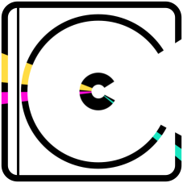

# CD Case Creator

**Version 1.1.3**

[Deutsch](#deutsch) · [English](#english)

A browser tool for designing CD case covers. Your artwork is fitted into the CD and case
areas of a template through colour masks, layered with stickers and text, and exported as a
PNG. Runs entirely offline — no build, no server, no uploads.

**Quick start:** double-click `playlist-cover-designer-v1.1.3.html`.

---
---

# Deutsch

Ein Browser-Werkzeug zum Gestalten von CD-Hüllen-Covern. Eigene Motive werden über
Farbmasken exakt in die CD- und Hüllenfläche einer Vorlage eingepasst, mit Sticker- und
Text-Ebenen überlagert und als PNG exportiert.

Läuft vollständig lokal: kein Build, kein Server, keine Uploads. Alle Bilder bleiben auf dem
eigenen Rechner.

**Sofort loslegen:** `playlist-cover-designer-v1.1.3.html` doppelklicken. Diese Datei ist
eigenständig — Schriften, Vorlagen und Gestaltung sind eingebettet, sie funktioniert ohne
Internet und ohne die übrigen Dateien.

## Was die App kann

- Motive über **Farbmasken** passgenau in CD- und Hüllenfläche einsetzen
- **Bis zu fünf Bild- und fünf Text-Ebenen**, frei stapelbar, jede einzeln transformierbar
- **Zehn eingebettete Schriften** mit Kontur, Deckkraft und freier Farbwahl
- **Hüllen-Tönung** — färbt den Kunststoff samt CD, aber nicht die außen aufgeklebten Sticker
- **Stanzen** — Text schneidet die Tönung heraus und gibt den klaren Blick darunter frei
- **Reflexion** mit einstellbarer Stärke und zufälliger Position
- Ziehen, Drehen und Skalieren direkt im Bild, mit Maus oder zwei Fingern
- **Zoom** bis 800 %, drei Prüfhintergründe
- **Hell- und Dunkelmodus**, **Deutsch und Englisch**
- **PNG-Export** in voller Vorlagenauflösung

## Wie es funktioniert

Die Vorlage ist ein PNG, in dem die gestaltbaren Flächen als **reines Grün** (die CD) und
**reines Rot** (die Hüllenfläche) ausgemalt sind. Das Programm erkennt diese Farben, schneidet
sie aus und benutzt sie als Schablonen. Alles, was du einfügst, wird auf diese Flächen
beschnitten — nichts steht über den Rand hinaus.

Drei Vorlagen sind eingebaut, alle drei lassen sich gegen eigene Dateien tauschen.

## Schritt für Schritt

### 1 · Referenz-Layer prüfen

Beim Start sind die drei mitgelieferten Vorlagen bereits geladen:

| Layer | Bedeutung |
| --- | --- |
| **Maske Grün** | Vorlage mit grüner CD-Fläche — bestimmt, wo das Motiv sitzt |
| **Maske Rot** | Zweite Zone auf der Hülle |
| **Reflexion / Glanz** | Lichtreflex, der über die rote Zone gelegt wird |

Jede Karte ist gleichzeitig ein Dateifeld: anklicken und eine eigene Datei wählen. Der
Papierkorb setzt den Layer zurück.

**Glanz-Deckkraft** regelt die Stärke der Reflexion in fünf Stufen.
**Zufällige Reflexion** verschiebt den Lichtreflex an eine neue Position — mit weichem
Übergang, nicht als Sprung.

### 2 · Basis-Motiv einsetzen

Das Basis-Motiv ist das Hauptbild auf der CD. Auf die gestrichelte Fläche tippen, Bild
wählen — fertig. Es liegt immer ganz hinten und immer auf der CD.

### 3 · Sticker und Text stapeln

Sticker- und Text-Ebenen teilen sich eine Liste, die sich wie ein Ebenenstapel liest:
**oben in der Liste heißt oben im Bild.** Neue Ebenen kommen über den leeren Slot ganz oben
dazu.

Jede Ebene hat eine Werkzeugzeile:

- **Bild ersetzen** — anderes Motiv in dieselbe Ebene laden
- **Pfeile** — eine Position nach vorn oder hinten
- **Zonen-Schalter** — wechselt zwischen CD und Hülle. Der Knopf trägt die Farbe der Zone,
  in die er verschiebt: roter Knopf heißt „auf die Hülle", grüner „auf die CD"
- **Schloss** — Ebene gegen versehentliches Verschieben sichern
- **Spiegeln** — horizontal kippen
- **Papierkorb** — Ebene löschen

### 4 · Text setzen

**Text-Layer hinzufügen** legt eine neue Textebene an. Zehn eingebettete Schriften stehen
bereit, jede im Auswahlraster in ihrer eigenen Schrift gesetzt.

- **Größe** bis 1800 px — bewusst weit über die Vorlage hinaus, für Layouts, bei denen die
  Schrift über den Rand läuft
- **Deckkraft** von 5 bis 100 %
- **Farbe** — Weiß, Schwarz, freie Farbe über Farbton/Sättigung/Helligkeit, oder **Stanzen**
- **Kontur** bis 120 px; die Konturfarbe ergibt sich automatisch aus der Füllung
- **Lage im Aufbau** — bei Text auf der CD: unter dem Glanz oder darüber

**Stanzen** gibt es nur für Text auf der Hülle und nur bei eingeschalteter Tönung. Die
Buchstaben schneiden die Tönung heraus und geben den ungetrübten Blick auf die CD und ihre
Sticker frei. Der Text selbst ist unsichtbar — er wirkt als Fenster.

### 5 · Ebene bearbeiten

Auf eine Ebene tippen, um sie auszuwählen (roter Rahmen). Dann:

- **Im Vorschaubild ziehen** verschiebt sie
- **Zwei Finger** drehen und skalieren gleichzeitig
- Die Regler für Skalierung, Drehung und Position X/Y machen dasselbe genauer
- **Layer zurücksetzen** stellt Ausgangsgröße, -drehung und -position wieder her

Gesperrte Ebenen reagieren auf nichts davon.

### 6 · Hüllen-Tönung

Färbt den Kunststoff der Hülle ein — und damit alles, was er einschließt: CD, Basis-Motiv,
die Sticker darauf und die Reflexion. Sticker, die außen auf der Hülle kleben, bleiben
unberührt; die transparenten Ränder ebenfalls.

**Abdunkeln** für satte, **Aufhellen** für milchige Tönungen. Farbton, Sättigung, Helligkeit
und Stärke sind frei einstellbar, das Farbfeld zeigt die Mischung live.

### 7 · Exportieren

**Cover exportieren** speichert das Bild in voller Vorlagenauflösung als PNG. Auf Geräten mit
Teilen-Funktion öffnet sich das native Teilen-Menü, sonst startet ein direkter Download.

## Vorschau-Werkzeuge

- **Zoom** über −/+, den Prozentwert zum Einpassen, oder Strg/Cmd + Scrollrad; über 100 %
  lässt sich der Ausschnitt verschieben
- **Hintergrund** zwischen Schachbrett, Dunkel und Hell umschalten, um Transparenz und helle
  wie dunkle Motive zu beurteilen
- Die **Statuszeile** unter der Bühne quittiert jede Aktion; rechts steht die Ausgabegröße

## Erscheinungsbild und Sprache

Oben rechts: **Hell/Dunkel** über den Mond- bzw. Sonnenknopf, **Deutsch/Englisch** über den
Sprachumschalter. Beides wirkt sofort, ohne Neuladen.

## Eigene Vorlagen

Eine Vorlage ist ein PNG in Zielauflösung (die mitgelieferten sind 1600 × 1600):

- Die CD-Fläche in reinem Grün ausmalen — erkannt wird, was deutlich grüner als rot und blau ist
- Die Hüllenfläche in reinem Rot
- Alles andere ist die sichtbare Hüllengrafik
- Transparente Bereiche bleiben transparent und werden von keinem Effekt erfasst

Beim Laden einer eigenen grünen Maske übernimmt das Programm deren Auflösung — der Export hat
dann genau diese Größe. Vorlagen weit jenseits von 1600 × 1600 sind für diesen Zweck
unverhältnismäßig und lassen die Oberfläche beim Laden kurz stocken.

## Gut zu wissen

Die Arbeit wird **nicht gespeichert**. Ein Neuladen der Seite verwirft die Komposition.

## Technik

Reines HTML, CSS und JavaScript. Keine Abhängigkeiten, kein Build-Schritt, keine
Netzwerkanfragen zur Laufzeit. Das Compositing läuft auf 2D-Canvas mit Pixel-Zugriff, die
Schriften sind eingebettet.

```
playlist-cover-designer-v1.1.3.html   Eigenständige Fassung — alles eingebettet
Spotify Playlist Designer.dc.html     Quelldatei
support.js                            Laufzeit-Hilfsfunktionen
fonts.css                             Die zehn eingebetteten Schriften
assets/                               Die drei Standard-Vorlagen
_ds/modernist-…/                      Gestaltung: Farben, Typografie, Komponenten
```

Zum Weiterarbeiten die Quelldatei bearbeiten, zum Verteilen die eigenständige Fassung.

---
---

# English

A browser tool for designing CD case covers. Your artwork is fitted into the CD and case
areas of a template through colour masks, layered with stickers and text, and exported as a
PNG.

Runs entirely on your machine: no build, no server, no uploads. Your images never leave the
computer.

**Quick start:** double-click `playlist-cover-designer-v1.1.3.html`. That file is
self-contained — fonts, templates and styling are embedded, and it works without an internet
connection and without the other files.

## What it does

- Fits artwork into the CD and case areas through **colour masks**
- **Up to five image and five text layers**, freely stacked, each transformed on its own
- **Ten embedded fonts** with outline, opacity and free colour choice
- **Case tint** — colours the plastic and the CD behind it, but not stickers stuck on the outside
- **Punch** — text cuts the tint away and reveals what lies beneath
- **Reflection** with adjustable strength and a randomised position
- Drag, rotate and scale directly in the artwork, with the mouse or two fingers
- **Zoom** up to 800 %, three test backgrounds
- **Light and dark mode**, **German and English**
- **PNG export** at the template's full resolution

## How it works

A template is a PNG in which the editable areas are painted **pure green** (the CD) and
**pure red** (the case area). The app detects those colours, cuts them out and uses them as
stencils. Anything you place is clipped to those areas — nothing spills over the edge.

Three templates are built in, and all three can be swapped for your own.

## Step by step

### 1 · Check the reference layers

The three bundled templates are already loaded at start:

| Layer | Meaning |
| --- | --- |
| **Green mask** | Template with the green CD area — defines where the artwork sits |
| **Red mask** | The second zone, on the case |
| **Reflection / gloss** | The highlight laid over the red zone |

Each card doubles as a file field: click it and pick your own file. The bin resets the layer.

**Gloss opacity** sets the strength of the reflection in five steps.
**Random reflection** moves the highlight elsewhere — as a soft crossfade, not a jump.

### 2 · Place the base motif

The base motif is the main image on the CD. Tap the dashed area, pick an image, done. It
always sits at the very back and always on the CD.

### 3 · Stack stickers and text

Sticker and text layers share one list that reads like a layer stack: **top of the list is
on top of the artwork.** New layers appear below the empty slot at the top.

Each layer has a toolbar:

- **Replace image** — load a different image into the same layer
- **Arrows** — one position forward or back
- **Zone switch** — moves between CD and case. The button carries the colour of the zone it
  moves *to*: a red button means "onto the case", a green one "onto the CD"
- **Lock** — protect the layer against accidental changes
- **Flip** — mirror horizontally
- **Bin** — delete the layer

### 4 · Set type

**Add text layer** creates a new text layer. Ten embedded fonts are available, each shown in
the picker set in its own typeface.

- **Size** up to 1800 px — deliberately far beyond the template, for layouts where the type
  runs off the edge
- **Opacity** from 5 to 100 %
- **Colour** — white, black, a free colour via hue/saturation/lightness, or **punch**
- **Outline** up to 120 px; the outline colour follows the fill automatically
- **Position in the stack** — for text on the CD: under the gloss or on top of it

**Punch** is available only for text on the case, and only with the tint switched on. The
letters cut the tint away and give an unfiltered view of the CD and its stickers. The text
itself is invisible — it acts as a window.

### 5 · Edit a layer

Tap a layer to select it (red border). Then:

- **Drag in the preview** to move it
- **Two fingers** rotate and scale at once
- The scale, rotation and position X/Y sliders do the same, precisely
- **Reset layer** restores the original size, rotation and position

Locked layers respond to none of it.

### 6 · Case tint

Colours the plastic of the case — and with it everything the case encloses: the CD, the base
motif, the stickers on it and the reflection. Stickers stuck on the outside stay untouched,
as do the transparent margins.

**Darken** for saturated tints, **Lighten** for milky ones. Hue, saturation, lightness and
strength are all adjustable, and the swatch previews the mix live.

### 7 · Export

**Export cover** saves the image as a PNG at the template's full resolution. On devices with
a share function the native share sheet opens; otherwise the download starts directly.

## Preview tools

- **Zoom** via −/+, the percentage to fit, or Ctrl/Cmd + scroll wheel; above 100 % the view
  can be panned
- **Background** switches between checker, dark and light, to judge transparency and both
  light and dark artwork
- The **status line** below the stage acknowledges every action; the output size is on the right

## Appearance and language

Top right: **light/dark** via the moon or sun button, **German/English** via the language
switch. Both take effect immediately, without a reload.

## Your own templates

A template is a PNG at your target resolution (the bundled ones are 1600 × 1600):

- Paint the CD area pure green — what counts as green is anything clearly greener than it is
  red and blue
- Paint the case area pure red
- Everything else is the visible case graphic
- Transparent areas stay transparent and are left alone by every effect

Loading your own green mask adopts its resolution — the export is then exactly that size.
Templates far beyond 1600 × 1600 are disproportionate for this purpose and will make the
interface stall briefly while loading.

## Worth knowing

Your work is **not saved**. Reloading the page discards the composition.

## Technical

Plain HTML, CSS and JavaScript. No dependencies, no build step, no network requests at
runtime. Compositing runs on 2D canvas with pixel access; the fonts are embedded.

```
playlist-cover-designer-v1.1.3.html   Self-contained build — everything embedded
Spotify Playlist Designer.dc.html     Source file
support.js                            Runtime helpers
fonts.css                             The ten embedded fonts
assets/                               The three default templates
_ds/modernist-…/                      Styling: colours, type, components
```

Edit the source file to develop further; ship the self-contained build.

---
---

## Lizenz · License

**CD Case Creator License** — © 2026 Patrick Majewski. Alle Rechte vorbehalten.

Nutzung zu privaten, nicht-kommerziellen Zwecken ist gestattet. Weitergabe, Veränderung,
Einbindung in andere Projekte und kommerzielle Nutzung bedürfen der vorherigen schriftlichen
Zustimmung des Autors.

Use is permitted for personal, non-commercial purposes. Redistribution, modification,
incorporation into other projects and commercial use require prior written permission from
the author.

Vollständiger Text · full text: [`LICENSE`](LICENSE)

Die eingebetteten Schriften stehen unabhängig davon unter der SIL Open Font License bzw.
Apache 2.0. · The embedded fonts are independently licensed under the SIL Open Font License
or Apache 2.0.
